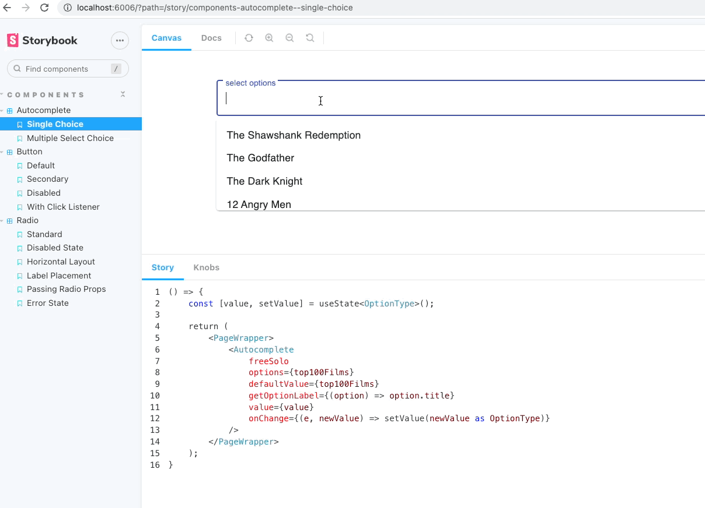

# Storybook for React App based on Material-UI and TypeScript

### How to start
- `yarn start`

### How to publish on gh-pages:
- `$ yarn build-storybook` // will output a static Storybook in the storybook-static directory
- `$ yarn deploy-storybook` // deployed to github static site hosting service.

FYI [gh-pages](https://ebazhanov.github.io/storybook-typescript-example)

----
